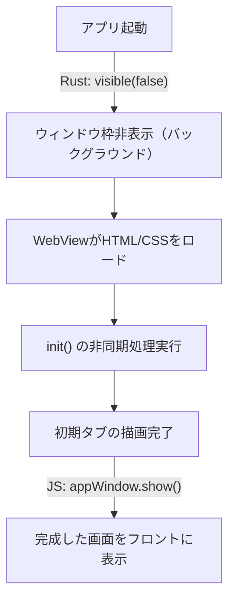

# 起動時のウィンドウ表示ガタつき修正 (Prevent Startup Flicker)

## 概要

アプリ起動時、OSのウィンドウ枠が表示された直後にWebViewのレンダリングや初期化処理（非同期IPC設定読み込み等）が走るため、タブやテキストエリアの表示が一瞬遅れて画面がガタつく（または白・黒一瞬フラッシュする）現象が発生する。
この改修では、**初期化完了までウィンドウを非表示にし、レンダリングが完全に整った状態で画面を表示する**ことで、ストレスフリーでシームレスな起動画面を実現する。

### 背景

- 現状、Tauriのウィンドウはデフォルトで起動時即表示（`visible: true`）される
- `main.js` の `init()` は、設定の取得 (`get_settings`) やテーマ適用 (`apply_theme`)、タブの作成 (`createNewTab`) などを非同期で連続して待ち合わせる
- これらが完了するまでの数十ミリ秒〜数百ミリ秒の間、中身のないガタついた状態が露出する

### 決定済み事項

| 項目 | 決定内容 |
|------|---------|
| ウィンドウ初期表示設定 | Rust側で起動時は `visible(false)` に設定 |
| ウィンドウ表示のタイミング | JS側の `init()` の最後（すべての初期レンダリング完了後）に表示 |

---

## 変更の影響範囲



---

## 変更計画

### Rustバックエンド（main.rs）

#### [MODIFY] [main.rs](file:///c:/work/NoCapEdit/src/main.rs)

**1. WindowBuilder で初期表示を非表示にする（L419-L429付近）**

`WindowBuilder` でウィンドウをビルドする際、`.visible(false)` メソッドを挟み、作成時点では画面に表示されないように制御する。

```diff
             let window = tauri::WindowBuilder::new(
                 app,
                 "main",
                 tauri::WindowUrl::App("index.html".into())
             )
             .title(format!("{} [ Ver {} ]", APP_DIR_NAME, env!("CARGO_PKG_VERSION")))
             .inner_size(WINDOW_WIDTH, WINDOW_HEIGHT)
             .min_inner_size(WINDOW_MIN_WIDTH, WINDOW_MIN_HEIGHT)
             .resizable(true)
             .fullscreen(false)
+            .visible(false)
             .build()?;
```

---

### フロントエンド（main.js）

#### [MODIFY] [main.js](file:///c:/work/NoCapEdit/src/dist/main.js)

**1. `init()` の最後に `appWindow.show()` を追加（L460-L480付近）**

設定読み込み、テーマの適用、および初期タブの作成（`createNewTab`）がすべて完了した時点で、ウィンドウを表示する。

```diff
         if (isFirstLaunch || isHomeFolderMissing) {
             openSettingsDialog(isHomeFolderMissing);
+            // 設定ダイアログ表示時もウィンドウを表示する
+            if (appWindow && typeof appWindow.show === 'function') {
+                await appWindow.show();
+            }
         } else {
             updateStatus('準備完了');
             setupUIEventListeners();
 
             // 起動時引数のチェック
             const launchFile = await invoke('get_launch_file');
             if (launchFile) {
                 await openExistingFile(launchFile);
             } else {
                 await createNewTab();
             }
 
             // アップデートチェックをバックグラウンドで開始
             if (settings.app_version) {
                 checkNewVersion(settings.app_version);
             }
+
+            // 初期化完了後にウィンドウを表示
+            if (appWindow && typeof appWindow.show === 'function') {
+                await appWindow.show();
+            }
         }
```

---

## 仕様書の更新

#### [MODIFY] [spec.md](file:///c:/work/NoCapEdit/docs/spec.md)

**セクション 3.3「ウィンドウの表示制御（新規）」に起動時のウィンドウ表示制御に関する記述を追記する**

追記内容：
- 起動時の画面のガタつきやチラつきを防ぐため、初期化処理（設定ロードやテーマの初期適用、初期タブ描画など）が完了するまでメインウィンドウを非表示（`visible: false`）とする。
- すべての初期表示用データの準備が整った段階でフロントエンドからウィンドウを表示（`show`）し、シームレスな起動を実現する。

---

## 検証計画

### 自動テスト
- `cargo build` でコンパイル・ビルドが成功すること

### 手動検証
- アプリを起動した際、ウィンドウ枠の表示と中身の表示がバラバラにならず、完全に描画が整った状態で綺麗に表示されることを確認する。
- 起動引数（関連付けダブルクリックなど）で起動した際も、ファイルが開かれた状態で正しくウィンドウが表示されることを確認する。
- 初回起動時（ホームフォルダ未設定時）も、ホーム設定ダイアログが表示された状態でウィンドウが表示されることを確認する。
