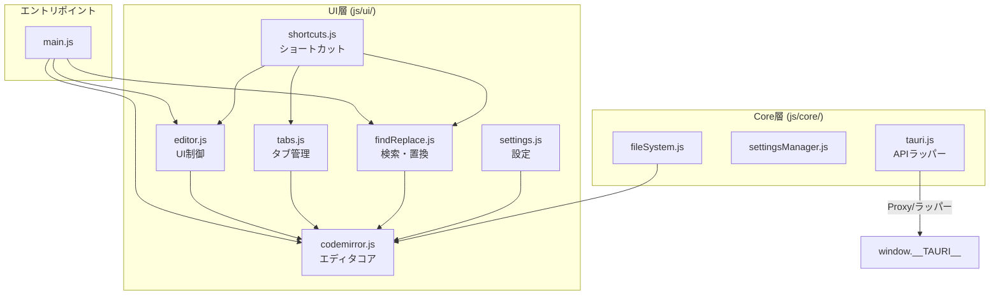

# NoCapEdit v0.2.0〜v0.2.11 アップデートレビュー
## CodeMirror (v6) 移行作業 総合評価レポート

---

## 1. 全体サマリー

| 項目 | 内容 |
|---|---|
| **対象バージョン** | v0.2.0 → v0.2.11（12ステップの内部バージョン） |
| **主目的** | HTML `<textarea>` から CodeMirror (v6) への完全移行 |
| **差分規模** | **+4,437行 / -2,379行**（44ファイル変更） |
| **ブランチ運用** | `master` → `v0.2` ブランチ、各機能ブランチから `--no-ff` マージ |
| **現在ブランチ** | `v0.2`（v0.2.11 マージ済み、master にもマージ済み） |

### 総合評価: ✅ **非常に良い**

段階的かつ計画的な移行が適切に実施されており、エディタ基盤の近代化に成功しています。

---

## 2. バージョン別進捗と評価

### フェーズ I: 基盤構築（v0.2.0〜v0.2.2）

#### v0.2.0 — 事前準備
- ✅ ブランチ戦略（旧v0.2のアーカイブ退避 → クリーン再作成）が適切
- ✅ 7ステップ構成の実装計画書を策定
- ✅ バージョン管理4ファイルの一斉更新

#### v0.2.1 — Vite環境構築
- ✅ `src/dist/` → `src/frontend/` のソース・成果物分離は正しい判断
- ✅ Vite + マルチページビルド（index.html + help.html）の構成が適切
- ✅ `.gitignore` でビルド成果物を除外

#### v0.2.2 — CodeMirror基本導入
- ✅ `codemirror.js` モジュール新設によるCodeMirror API の一元管理が優秀
- ✅ 日本語IMEインライン入力の不具合を早期に発見・修正（`drawSelection`/`dropCursor` 追加）
- ✅ 既存の `tabs.js`, `settings.js`, `findReplace.js` への影響範囲を限定的に制御

### フェーズ II: コア機能移行（v0.2.3〜v0.2.7）

#### v0.2.3 — タブ管理（EditorState分離）
- ✅ **設計の最重要ポイント**: タブごとの `EditorState` 直接保持＋ `setState()` による切り替え
- ✅ タブ間 Undo/Redo 履歴の完全独立化を達成
- ✅ `createTabState()`, `getEditorState()`, `setEditorState()` の3つの明確なAPIで状態管理を一本化

#### v0.2.4 — 外観設定の動的連携
- ✅ **Compartment パターン**（`wrapCompartment`, `indentCompartment`, `themeCompartment`）の導入が適切
- ✅ エディタを再構築することなく折り返し・インデント・テーマを瞬時変更
- ✅ CSS変数との統合で既存のテーマシステムとの整合性を維持

#### v0.2.5 — エディタ操作のコマンド統合
- ✅ CodeMirror 6 標準コマンド（`moveLineUp/Down`, `copyLineUp/Down`, `deleteLine`, `indentWithTab`）への完全移行
- ✅ `insertTimestampCommand` のトランザクション実装で Undo/Redo 連動を実現
- ✅ 旧 textarea 依存コードの完全削除でデッドコードを排除

#### v0.2.6 — 検索・置換（@codemirror/search）
- ✅ 公式 `@codemirror/search` の導入で保守性向上
- ✅ `highlightSelectionMatches` による選択単語ハイライト追加
- ✅ 旧 `findReplace.js`（約390行）の完全削除

#### v0.2.7 — 最終検証
- ✅ 全ビルドチェーン（`npm run build` → `cargo check` → `cargo build --release`）の通過確認
- ✅ ウォークスルー文書の作成

### フェーズ III: 品質改善（v0.2.8〜v0.2.11）

#### v0.2.8 — ヘルプ画面修正
- ✅ `100vh` 固定高さの解除によるスクロール不具合の修正
- ✅ 開発者情報・リポジトリリンクの設置

#### v0.2.9 — ポータブル版起動不具合修正
- ✅ **重要な堅牢性改善**: Tauri API の動的解決化（Proxy/ラッパーパターン）
- ✅ Rust側タイマーフォールバック（1.5秒）の安全装置追加
- ✅ `DOMContentLoaded` の `try/catch/finally` でウィンドウ表示を保証

#### v0.2.10 — 検索・置換UI刷新
- ✅ v0.1系で好評だった右上フロート型UIの CodeMirror 6 基盤での完全再現
- ✅ `findReplace.js` の再設計（CodeMirror トランザクションベースの置換処理）
- ✅ i18n 対応の維持

#### v0.2.11 — single-instance プラグイン移行
- ✅ 自前 TCP ソケット → `tauri-plugin-single-instance` への移行でセキュリティ改善
- ✅ `src/instance.rs` の削除によるコードベース簡素化
- ✅ バージョンチェックの系統制限解除

---

## 3. アーキテクチャ評価

### 3.1 モジュール設計 ✅ 優秀



**良い点:**
- `codemirror.js` がエディタ操作の **Single Point of Entry** として機能
- UI層とCore層の分離が明確
- `tauri.js` の動的解決Proxyパターンが Webview2 の読み込み順問題を根本解決

### 3.2 CodeMirror 統合パターン ✅ 適切

| パターン | 適用箇所 | 評価 |
|---|---|---|
| **Compartment** | 折り返し・インデント・テーマ | ✅ 再構築不要の動的変更 |
| **EditorState** 分離 | タブ管理 | ✅ 完全独立 Undo/Redo |
| **updateListener** | 変更通知 | ✅ コールバック経由の疎結合 |
| **keymap** | エディタ操作 | ✅ 標準コマンド活用 |
| **トランザクション** | 置換・タイムスタンプ挿入 | ✅ Undo/Redo 連動 |

### 3.3 CSS変数 × CodeMirrorテーマ ✅ 一貫性あり

[baseTheme](file:///c:/work/NoCapEdit/src/frontend/js/ui/codemirror.js#L73-L175) で CSS変数（`--text-primary`, `--accent`, `--editor-font-size` 等）を参照し、既存のテーマシステムとシームレスに統合されています。

---

## 4. コード品質評価

### 4.1 良い点 ✅

1. **JSDoc コメントの充実**: [codemirror.js](file:///c:/work/NoCapEdit/src/frontend/js/ui/codemirror.js) の全 export 関数に型情報付きドキュメントが記述されている
2. **安全性の考慮**: `setSelection()` での境界値クランプ（`Math.max(0, Math.min(...))`）
3. **フェイルセーフ**: [main.js](file:///c:/work/NoCapEdit/src/frontend/js/main.js) の `DOMContentLoaded` で二重の `finally` ブロックによるウィンドウ表示保証
4. **IME対応**: `view.composing` チェックによる日本語入力中のショートカット抑制
5. **i18n準拠**: AGENTS.md のコーディング規約に従い、新規UIテキストは `i18n.js` 経由

### 4.2 注意点・改善候補 ⚠️

#### (1) `searchKeymap` の未使用 import

[codemirror.js L11](file:///c:/work/NoCapEdit/src/frontend/js/ui/codemirror.js#L11) で `searchKeymap` を import していますが、`getDefaultExtensions()` の `keymap.of([])` 内に含まれていません。`search({ top: true })` が自動的にキーマップを登録するため動作には影響しませんが、未使用 import として明示的に削除するか、意図的に残す場合はコメントがあるとよいでしょう。

```javascript
// L11: import { search, searchKeymap, highlightSelectionMatches, ... } from '@codemirror/search';
//                     ^^^^^^^^^^^^^ getDefaultExtensions() で使用されていない
```

#### (2) spec.md の検索・置換セクションの矛盾

[spec.md §5.1](file:///c:/work/NoCapEdit/docs/spec.md#L289) の「将来の拡張候補」にまだ「検索・置換機能」が残っています。v0.2.10 で検索・置換UIを完全に刷新済みのため、このリストから削除すべきです。

#### (3) `codemirror.js` の `openSearch`/`closeSearch` 関数の使用状況

[codemirror.js](file:///c:/work/NoCapEdit/src/frontend/js/ui/codemirror.js) で `openSearch()`/`closeSearch()` が定義されていますが、v0.2.10 でカスタム検索UIに移行した結果、これらの関数は現在どこからも呼ばれていない可能性があります。デッドコードであれば削除を検討してください。

#### (4) `getCursorMetrics` のパフォーマンス

[codemirror.js getCursorMetrics()](file:///c:/work/NoCapEdit/src/frontend/js/ui/codemirror.js) で毎回 `doc.toString()` を呼んでいます。大きなドキュメントではコストが高くなる可能性があります。`doc.length` や `doc.sliceString()` で必要な部分だけ取得する最適化が将来的に有効です。

#### (5) history.md の日付が全て同一

[history.md](file:///c:/work/NoCapEdit/docs/history.md) の v0.2.0〜v0.2.11 の全エントリが `2026-08-23` となっています。1日で12バージョン分の作業が完了したことを示していますが、実際に複数日にわたっていた場合は正確な日付に修正すべきです。

---

## 5. Gitブランチ運用の評価 ✅

```mermaid
gitgraph
    commit id: "master (v0.1.x)"
    branch v0.2
    checkout v0.2
    commit id: "v0.2.0 計画策定"
    branch feature/codemirror-v6
    checkout feature/codemirror-v6
    commit id: "Step 1: Vite"
    commit id: "Step 2: CM導入"
    commit id: "Step 3: タブ管理"
    commit id: "Step 4: 外観"
    commit id: "Step 5: コマンド"
    commit id: "Step 6: 検索"
    commit id: "Step 7: 検証"
    checkout v0.2
    merge feature/codemirror-v6 id: "v0.2.7" tag: "no-ff"
    branch fix/help-scroll
    commit id: "ヘルプ修正"
    checkout v0.2
    merge fix/help-scroll id: "v0.2.8" tag: "no-ff"
    branch fix/portable-launch
    commit id: "起動修正"
    checkout v0.2
    merge fix/portable-launch id: "v0.2.9" tag: "no-ff"
    branch feat/custom-find-replace-ui
    commit id: "検索UI刷新"
    checkout v0.2
    merge feat/custom-find-replace-ui id: "v0.2.10" tag: "no-ff"
    branch feat/single-instance-plugin
    commit id: "SI移行"
    checkout v0.2
    merge feat/single-instance-plugin id: "v0.2.11" tag: "no-ff"
    checkout main
    merge v0.2 id: "master統合"
```

**良い点:**
- 全ての作業ブランチを `--no-ff` マージで分岐・合流の履歴が視覚的に明確
- AGENTS.md の運用ルールに完全準拠
- 作業用ドキュメントのクリーンアップ（`docs/[機能名]/` 削除）が各バージョンで確実に実施

---

## 6. 依存パッケージ評価

[package.json](file:///c:/work/NoCapEdit/package.json) の依存関係:

| パッケージ | バージョン | 評価 |
|---|---|---|
| `@codemirror/commands` | ^6.11.0 | ✅ 最新系 |
| `@codemirror/language` | ^6.12.4 | ✅ 最新系 |
| `@codemirror/search` | ^6.7.1 | ✅ 最新系 |
| `@codemirror/state` | ^6.7.1 | ✅ 最新系 |
| `@codemirror/view` | ^6.43.9 | ✅ 最新系 |
| `codemirror` | ^6.0.2 | ✅ メタパッケージ |
| `vite` | ^6.0.0 | ✅ 最新系（devDependency） |
| `tauri-plugin-single-instance` | git (v1ブランチ) | ⚠️ Git依存（後述） |

> [!NOTE]
> `tauri-plugin-single-instance` が Git URL 参照（`branch = "v1"`）です。Tauri v1 系では crates.io に公式リリースがないため妥当ですが、将来的な Tauri v2 移行時にはレジストリ版に切り替えるべきです。

---

## 7. まとめ

### 達成事項 ✅
- ✅ `<textarea>` から CodeMirror (v6) への完全移行
- ✅ タブごとの独立 Undo/Redo 履歴
- ✅ Compartment による動的設定制御
- ✅ Vite ビルド環境の導入
- ✅ 日本語IME対応
- ✅ カスタム検索・置換UI（v0.1風フロートレイアウト）の復元
- ✅ ポータブル版の起動堅牢性向上
- ✅ TCP ソケットの廃止とセキュリティ改善

### 推奨アクション（優先度順）
1. **🟡 低**: `spec.md` §5.1 から「検索・置換機能」を将来候補リストから削除
2. **🟡 低**: `searchKeymap` の未使用 import 整理
3. **🟡 低**: `openSearch()`/`closeSearch()` のデッドコード確認
4. **🟢 将来**: `getCursorMetrics` の大ドキュメント向けパフォーマンス最適化
5. **🟢 将来**: Tauri v2 移行時の `tauri-plugin-single-instance` レジストリ版切り替え
