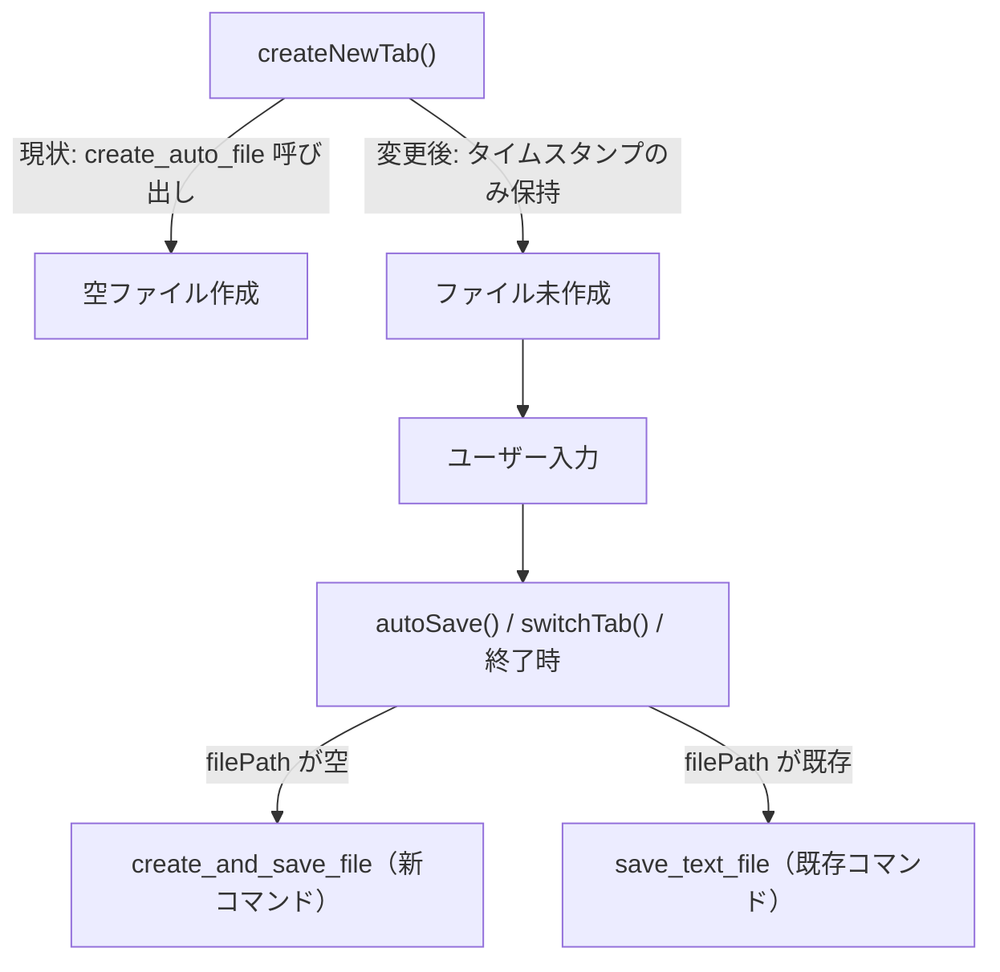

# ファイル遅延作成（Deferred File Creation）

## 概要

現在、自動保存モードでは新規タブ作成時に即座に空ファイル（0バイト）をディスクに作成している。
この改修では、**ファイルの実体作成を初回保存時まで遅延**させることで、不要なディスクI/Oの削減、孤児ファイルの防止、クリーンアップロジックの簡略化を実現する。

### 背景

- 現状、タブを開くたびに `create_auto_file` で空ファイルが作成されるが、入力せずに閉じた場合は `shouldDeleteEmptyFile` で削除される（作って消すの往復I/O）
- アプリがクラッシュした場合、空ファイルがディスクに残る（孤児ファイル問題）
- 手動保存モードでは既にファイル遅延作成が実現されており、同じパターンを自動保存モードにも適用する

### 決定済み事項

| 項目 | 決定内容 |
|------|---------|
| タイムスタンプの基準 | タブ作成時の時刻を使用（現状と同じ） |
| shouldDeleteEmptyFile | 既存ファイルが空になった場合は引き続き削除（現状維持） |
| Rust側の実装方針 | 新コマンド `create_and_save_file` でパス生成＋保存を1回のIPCで実行 |

---

## 変更の影響範囲



---

## 変更計画

### Rustバックエンド（main.rs）

#### [MODIFY] [main.rs](file:///c:/work/NoCapEdit/src/main.rs)

**1. `next_available_file_path` の引数変更（L193-L214）**

現在は内部で `Local::now()` を呼び出してタイムスタンプを生成しているが、フロントエンドからタブ作成時のタイムスタンプを受け取れるように引数を追加する。

```diff
-fn next_available_file_path(home_folder: &PathBuf) -> Result<(String, PathBuf), String> {
-    let base = Local::now().format(DATETIME_FORMAT).to_string();
+fn next_available_file_path(home_folder: &PathBuf, timestamp: &str) -> Result<(String, PathBuf), String> {
+    let base = timestamp.to_string();
     let mut index = 0u32;
     // ... 以下同じ
```

**2. `create_and_save_file` コマンドの追加**

`create_auto_file` を置き換える新コマンド。パス生成と内容の書き込みを1回のIPC呼び出しでアトミックに実行する。

```rust
#[tauri::command]
fn create_and_save_file(
    home_folder: PathBuf,
    timestamp: String,
    content: String,
) -> Result<FileInfo, String> {
    fs::create_dir_all(&home_folder).map_err(|e| e.to_string())?;

    let (file_name, file_path) = next_available_file_path(&home_folder, &timestamp)?;

    // 内容を正規化してアトミック書き込み
    let normalized = normalize_crlf(&content);
    let tmp_path = file_path.with_extension("tmp");
    fs::write(&tmp_path, &normalized).map_err(|e| e.to_string())?;
    fs::rename(&tmp_path, &file_path).map_err(|e| e.to_string())?;

    Ok(FileInfo {
        file_name,
        file_path: file_path.to_string_lossy().to_string(),
    })
}
```

**3. `create_auto_file` コマンドの削除（L262-L273）**

`create_and_save_file` に置き換えられるため、既存の `create_auto_file` は削除する。

**4. `invoke_handler` の更新（L457-L468）**

```diff
 .invoke_handler(tauri::generate_handler![
     get_settings,
     save_settings,
-    create_auto_file,
+    create_and_save_file,
     read_text_file,
     save_text_file,
     delete_text_file,
     exit_app,
     get_launch_file,
     apply_theme,
     get_system_fonts
 ])
```

---

### フロントエンド（main.js）

#### [MODIFY] [main.js](file:///c:/work/NoCapEdit/src/dist/main.js)

**1. タブオブジェクトに `createdTimestamp` プロパティを追加**

タブ作成時のタイムスタンプ（`yyyymmdd_hhmmss` 形式）を保持するプロパティを追加する。これは初回保存時のファイル名生成に使用される。

```javascript
const tab = {
    id: generateTabId(),
    fileName: fileName,
    filePath: filePath,
    content: '',
    isDirty: false,
    isSaving: false,
    savePromise: null,
    createdTimestamp: timestamp,  // 追加: "20260711_120641" 形式
};
```

**2. `createNewTab()` の変更（L960-L1013）**

自動保存モードでも `create_auto_file` を呼ばず、手動保存モードと同様にタイムスタンプのみ生成してファイルは作成しない。

```diff
 async function createNewTab() {
     // ...
     let fileName = '';
     let filePath = '';
+    let timestamp = '';
+
+    const now = new Date();
+    const yyyy = now.getFullYear();
+    const mm = String(now.getMonth() + 1).padStart(2, '0');
+    const dd = String(now.getDate()).padStart(2, '0');
+    const hh = String(now.getHours()).padStart(2, '0');
+    const min = String(now.getMinutes()).padStart(2, '0');
+    const ss = String(now.getSeconds()).padStart(2, '0');
+    timestamp = `${yyyy}${mm}${dd}_${hh}${min}${ss}`;

     if (appState.saveMode === 'manual') {
         updateStatus('新規タブを作成', 'saved');
-        const now = new Date();
-        // ... 日時パーツ取得 ...
         fileName = `[${yyyy}/${mm}/${dd} ${hh}:${min}:${ss}]`;
     } else {
-        updateStatus('新規ファイル作成中...', 'saving');
-        const file = await invoke('create_auto_file', {
-            homeFolder: appState.homeFolder,
-        });
-        fileName = file.file_name;
-        filePath = file.file_path;
+        updateStatus('新規タブを作成', 'saved');
+        fileName = `${timestamp}.nctx`;
+        // filePath は空のまま（ファイル未作成）
     }

     const tab = {
         id: generateTabId(),
         fileName: fileName,
         filePath: filePath,
         content: '',
         isDirty: false,
         isSaving: false,
         savePromise: null,
+        createdTimestamp: timestamp,
     };
     // ...
 }
```

**3. `saveTabIfDirty()` の変更（L1046-L1078）**

`filePath` が空（ファイル未作成）の場合、`create_and_save_file` を呼んでファイル生成と保存を同時に行う。

```diff
 async function saveTabIfDirty(tab) {
     if (!tab || !tab.isDirty) return;
     // ... isSaving チェック ...

     tab.isSaving = true;
     tab.savePromise = (async () => {
         try {
+            if (!tab.filePath) {
+                // 初回保存：ファイル生成＋内容書き込みを同時実行
+                const file = await invoke('create_and_save_file', {
+                    homeFolder: appState.homeFolder,
+                    timestamp: tab.createdTimestamp,
+                    content: tab.content,
+                });
+                tab.filePath = file.file_path;
+                tab.fileName = file.file_name;
+            } else {
+                // 2回目以降：既存ファイルに上書き保存
                 await invoke('save_text_file', {
                     filePath: tab.filePath,
                     content: tab.content,
                 });
+            }
             tab.isDirty = false;
             renderTabs();
         } finally {
             tab.isSaving = false;
             tab.savePromise = null;
         }
     })();

     await tab.savePromise;
 }
```

**4. `shouldDeleteEmptyFile()` の変更（L1113-L1119）**

タブに `filePath` がない場合（ファイル未作成）は削除不要なので早期リターンする。

```diff
 function shouldDeleteEmptyFile(tab) {
+    // ファイルが未作成の場合は削除不要
+    if (!tab.filePath) {
+        return false;
+    }
     const trimmed = tab.content.trim();
     if (trimmed !== '') {
         return false;
     }
     return isAutoCreatedFileName(tab.fileName);
 }
```

**5. `persistTabWithRecovery()` の変更（L237-L293）**

ファイル未作成かつ内容が空のタブは、削除も保存も不要なのでスキップする。

```diff
 async function persistTabWithRecovery(tab, contextLabel) {
     if (!tab) return true;

     if (shouldDeleteEmptyFile(tab)) {
         // ... 既存の削除ロジック（filePath がある場合のみ到達）
     }

     if (appState.saveMode === 'manual') return true;
-    if (!tab.isDirty) return true;
+    if (!tab.isDirty) {
+        // 内容が空でファイル未作成なら、保存不要
+        return true;
+    }
     // ... 以下同じ
 }
```

> [!NOTE]
> `persistTabWithRecovery` 内の `!tab.isDirty` チェックは既存のままで問題ない。新規タブで何も入力せずにタブを閉じる場合、`isDirty` は `false` のままなので保存はスキップされ、ファイルも作成されない。

**6. `triggerManualSave()` の変更（L1195-L1245）**

自動保存モードで `filePath` が空の場合の処理を追加。`saveTabIfDirty` が初回保存を処理するため、`isDirty` を `true` に設定してから呼び出す。

```diff
     } else {
+        // 自動保存モード
         tab.isDirty = true;
         await saveTabIfDirty(tab);
     }
```

> [!NOTE]
> 自動保存モードの手動保存（Ctrl+S）は、既存の `saveTabIfDirty` を呼び出すだけなので、変更点3の `filePath` 空チェックがそのまま適用される。追加の変更は不要。

**7. `openExistingFile()` への `createdTimestamp` 追加**

既存ファイルを開く際にも `createdTimestamp` を設定する（空文字列）。既存ファイルでは使用されないが、タブオブジェクトの構造を統一する。

---

### 仕様書の更新

#### [MODIFY] [spec.md](file:///c:/work/NoCapEdit/docs/spec.md)

**セクション 4.2「起動時・新規作成時のファイル自動生成」の更新**

現在の記述：
> アプリ起動時、ホームフォルダ配下に新規テキストファイル（.nctx）を自動作成する。

変更後の記述（要旨）：
- 自動保存モードでも、起動時・新規タブ作成時にはファイルの実体を作成しない
- タブ作成時にタイムスタンプを記録し、初回の自動保存時にファイルを生成して内容を書き込む
- ファイル名のタイムスタンプはタブ作成時の時刻を使用する

**セクション 4.3「自動クリーンアップ」の更新**

- ファイル未作成のタブ（`filePath` なし）は、閉じる際にディスク操作不要
- 既存ファイルを開いて内容を全削除した場合の空ファイル削除ロジックは維持

---

## 検証計画

### 自動テスト
- `cargo build` でRustコードのビルド確認
- `cargo test`（テストがある場合）

### 手動検証

| # | シナリオ | 期待動作 |
|---|---------|---------|
| 1 | 起動時に新規タブが作成される | ファイルは作成されず、タブ表示名にタイムスタンプが表示される |
| 2 | 新規タブに文字を入力し、3秒待つ | 自動保存が発動し、ファイルが初めて作成される |
| 3 | 新規タブに何も入力せずに閉じる | ファイルが作成されない（ディスク操作なし） |
| 4 | 新規タブに入力 → 保存 → タブ閉じる | 保存済みファイルが残る |
| 5 | 新規タブに入力 → 保存 → 全削除 → タブ閉じる | 空ファイルが削除される |
| 6 | 「+」ボタンで複数タブ作成 → それぞれに入力 | 各タブに固有のタイムスタンプでファイルが作成される |
| 7 | 新規タブに入力 → タブ切り替え | 切り替え時に初回保存が実行される |
| 8 | 新規タブに入力 → Ctrl+S | 手動保存で初回ファイル作成される |
| 9 | 新規タブに入力 → アプリ終了 | 終了時に初回保存が実行される |
| 10 | 新規タブ（未入力） → アプリ終了 | ファイルは作成されない |
| 11 | 既存ファイルを開いて編集 → 保存 | 通常通り上書き保存される（既存フローに影響なし） |
| 12 | 手動保存モードでの動作 | 従来と同じ動作（変更なし） |
| 13 | ファイル関連付けから.nctxファイルを開く | 通常通り開ける（既存フローに影響なし） |
