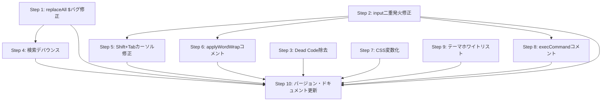

# マスタープラン: コードレビュー指摘事項の修正 (Ver 0.1.72〜0.1.85)

## 概要

[コードレビュー結果](file:///c:/work/NoCapEdit/docs/wip/code_review_v0.1.72_to_v0.1.85.md) で検出された 🔴 Critical 2件・🟡 Warning 5件・🔵 Info 3件の指摘事項を、安全かつ段階的に修正する。

## 基本方針

- **1ステップ = 1ファイル（原則）** を守り、影響範囲を局所化する
- **各ステップ完了時に動作確認** を実施し、デグレードを即座に検知する
- **Critical → Warning → Info** の優先度順に対応する
- 全ステップを **1つのバージョン（0.1.86）** にまとめる
- 既存設定の変更（I-3: tauri.conf.json セキュリティ）は影響範囲が広いため **対象外** とする

---

## 修正ステップ一覧

| Step | 対象 | ファイル | 内容 | 重要度 |
|------|------|----------|------|--------|
| 1 | C-1 | `findReplace.js` | `replaceAll` の `$` 特殊文字バグ修正 | 🔴 |
| 2 | C-2 | `editor.js` | `input` イベント二重発火修正 | 🔴 |
| 3 | W-1 | `shortcuts.js` | 到達不能コード（Dead Code）除去 | 🟡 |
| 4 | W-2 | `findReplace.js` | 検索バー入力時のデバウンス導入 | 🟡 |
| 5 | W-3 | `editor.js` | Shift+Tab アンインデント時カーソル位置修正 | 🟡 |
| 6 | W-4 | `editor.js` | `applyWordWrap` 呼び出し前の安全性強化 | 🟡 |
| 7 | W-5 | `style.css` | ハイライト色の CSS 変数化 | 🟡 |
| 8 | I-1 | `editor.js` | `execCommand` 非推奨 API のリスクコメント追記 | 🔵 |
| 9 | I-2 | `help.js` | テーマ値ホワイトリスト検証追加 | 🔵 |
| 10 | — | ドキュメント | バージョン番号更新・変更履歴追記 | — |

---

## 各ステップの詳細

### Step 1: `replaceAll` の `$` 特殊文字バグ修正 🔴

**対象ファイル**: [`findReplace.js`](file:///c:/work/NoCapEdit/src/dist/js/ui/findReplace.js#L267-L268)

**問題**: `fullText.replace(regex, replaceText)` で置換後文字列に `$&`, `$1` 等が含まれると意図しない結果になる。

**修正内容**:
```diff
- newFullText = fullText.replace(regex, replaceText);
+ newFullText = fullText.replace(regex, () => replaceText);
```

**動作確認**:
1. 検索文字列: `abc`、置換文字列: `$&test` で「すべて置換」 → `$&test` がそのまま挿入されることを確認
2. 通常の置換（特殊文字なし）が従来通り動作することを確認
3. 大文字小文字区別あり（`split/join` パス）の動作が影響を受けていないことを確認

---

### Step 2: `input` イベント二重発火修正 🔴

**対象ファイル**: [`editor.js`](file:///c:/work/NoCapEdit/src/dist/js/ui/editor.js#L188-L206)

**問題**: `execCommand` 成功時にブラウザ自動発火 + 手動発火で `input` イベントが2回発生。

**修正内容**:
```diff
 export function applyEditorTextWithUndo(replaceStart, replaceEnd, replacementText, newSelectionStart, newSelectionEnd) {
     if (!elements.editor) return;

     elements.editor.focus();
     elements.editor.setSelectionRange(replaceStart, replaceEnd);

-    // document.execCommand('insertText') を使用することでブラウザネイティブのUndo/Redoスタックに正常に記録
-    if (!document.execCommand('insertText', false, replacementText)) {
-        // execCommand が失敗した場合のフォールバック
+    // document.execCommand('insertText') はブラウザネイティブのUndo/Redoスタックに記録される。
+    // 成功時はブラウザが自動的に input イベントを発火する。
+    const success = document.execCommand('insertText', false, replacementText);
+    if (!success) {
+        // execCommand が失敗した場合のフォールバック（input イベントは自動発火されない）
         elements.editor.setRangeText(replacementText, replaceStart, replaceEnd, 'end');
+        elements.editor.dispatchEvent(new Event('input'));
     }

     if (newSelectionStart !== undefined && newSelectionEnd !== undefined) {
         elements.editor.setSelectionRange(newSelectionStart, newSelectionEnd);
     }
-
-    // 自動保存やステータス表示を連動
-    elements.editor.dispatchEvent(new Event('input'));
 }
```

**動作確認**:
1. テキスト入力 → Ctrl+Z で Undo → Ctrl+Y で Redo が正常に動作することを確認
2. 行移動（Alt+↑/↓）→ Undo が正常動作することを確認
3. 行複製・削除 → Undo が正常動作することを確認
4. タイムスタンプ挿入（F5）→ Undo が正常動作することを確認
5. 検索・置換（1件置換・全件置換）→ Undo が正常動作することを確認
6. Tab/Shift+Tab インデント → Undo が正常動作することを確認
7. 自動保存が正常にトリガーされることを確認（ステータスバーが「保存済み」に変わる）

> [!IMPORTANT]
> このステップは影響範囲が最も広い（すべてのテキスト編集操作が `applyEditorTextWithUndo` を経由する）。動作確認を特に入念に行うこと。

---

### Step 3: 到達不能コード（Dead Code）除去 🟡

**対象ファイル**: [`shortcuts.js`](file:///c:/work/NoCapEdit/src/dist/js/ui/shortcuts.js#L154)

**問題**: ズーム拡大の条件式に `(e.code === 'Semicolon' && e.shiftKey)` が含まれるが、Shift 押下時は手前のブロックで return されるため到達不能。

**修正内容**:
```diff
- if (e.key === '+' || e.key === '=' || e.key === ';' || e.code === 'NumpadAdd' || e.code === 'Equal' || (e.code === 'Semicolon' && e.shiftKey)) {
+ if (e.key === '+' || e.key === '=' || e.key === ';' || e.code === 'NumpadAdd' || e.code === 'Equal') {
```

**動作確認**:
1. Ctrl + `+`（または `=`）でズーム拡大が動作することを確認
2. Ctrl + `-` でズーム縮小が動作することを確認
3. Ctrl + Shift + `;`（`+`）で行間拡大が動作することを確認

---

### Step 4: 検索バー入力時のデバウンス導入 🟡

**対象ファイル**: [`findReplace.js`](file:///c:/work/NoCapEdit/src/dist/js/ui/findReplace.js#L295-L299)

**問題**: 検索ウィジェット表示中、1キーストロークごとに全文検索 + DOM再構築が同期実行される。

**修正内容**:
- モジュールスコープにデバウンスタイマー変数を追加
- `input` イベントリスナー内で `setTimeout` によるデバウンス（200ms）を導入
- ウィジェットを閉じる際にタイマーをクリアする処理を追加

**動作確認**:
1. 検索バー表示中にエディタで高速入力しても遅延なく入力できることを確認
2. 入力停止後にハイライトが正しく更新されることを確認
3. 検索バーを閉じて再度開いた際に正常動作することを確認

---

### Step 5: Shift+Tab アンインデント時カーソル位置修正 🟡

**対象ファイル**: [`editor.js`](file:///c:/work/NoCapEdit/src/dist/js/ui/editor.js#L289-L296)

**問題**: 複数行選択で Shift+Tab を押した際、`newSelectionEnd` の計算が `totalRemovedCount` に依存し、選択終了位置の行からインデントが削除されなかった場合にズレる可能性がある。

**修正内容**:
- 選択終了位置が含まれる行に対して、その行以前の行から削除された文字数のみを考慮するように修正
- 選択終了位置が行頭の場合のエッジケースを追加処理

**動作確認**:
1. 3行選択（うち最終行はインデントなし）で Shift+Tab → 選択範囲が崩れないことを確認
2. 1行選択の Shift+Tab → 従来通り正常動作することを確認
3. 全行インデントありの複数行選択 → 従来通り正常動作することを確認
4. Shift+Tab → Ctrl+Z (Undo) → 元に戻ることを確認

---

### Step 6: `applyWordWrap` 呼び出し前の安全性強化 🟡

**対象ファイル**: [`editor.js`](file:///c:/work/NoCapEdit/src/dist/js/ui/editor.js#L148)

**問題**: 全タブ閉鎖状態で設定変更した場合の安全性。既にガードはあるが明示性を強化。

**修正内容**:
- `applyWordWrap` 内の null ガードが既に存在するため、コードの変更は不要
- コメントで「全タブ閉鎖時は elements.editor が null になりうる」旨を明記

**動作確認**:
1. 全タブを閉じた状態で設定画面から折り返し設定を変更してもエラーが出ないことを確認

---

### Step 7: ハイライト色の CSS 変数化 🟡

**対象ファイル**: [`style.css`](file:///c:/work/NoCapEdit/src/dist/style.css)

**問題**: 検索ハイライト・フォーカスアウトラインの色がハードコードされており、テーマ追加時の保守性が低い。

**修正内容**:
- 各テーマ（Dark / Soft Dark / Light）の CSS 変数定義に以下を追加:
  - `--search-highlight-bg`: 検索ハイライト背景色
  - `--search-highlight-current-bg`: 現在位置ハイライト背景色
  - `--focus-outline-color`: フォーカスアウトライン色
- ハードコードされた色値を `var(--xxx)` に置換

**動作確認**:
1. 3テーマそれぞれで検索ハイライトの視認性を確認
2. フォーカスアウトラインの視認性を確認
3. テーマ切り替え時にハイライト色が即座に追従することを確認

---

### Step 8: `execCommand` 非推奨 API のリスクコメント追記 🔵

**対象ファイル**: [`editor.js`](file:///c:/work/NoCapEdit/src/dist/js/ui/editor.js#L194-L195)

**修正内容**: `applyEditorTextWithUndo` 関数のコメントに `execCommand` が W3C 非推奨である旨と、Tauri v1 (WebView2) では正常動作すること、将来の代替手段に関する注記を追記。

> [!NOTE]
> Step 2 と同じファイル・同じ関数だが、Step 2 の修正とは独立したコメント追記のため別ステップとして管理する。実装時は Step 2 の修正後の状態に対してコメントを追記する。

---

### Step 9: テーマ値ホワイトリスト検証追加 🔵

**対象ファイル**: [`help.js`](file:///c:/work/NoCapEdit/src/dist/js/help.js)

**修正内容**:
- URL クエリパラメータから取得したテーマ値を `['dark', 'soft-dark', 'light']` のホワイトリストで検証
- 不正な値の場合はデフォルト (`dark`) にフォールバック

**動作確認**:
1. F1 でヘルプ画面を開き、メイン画面と同じテーマが適用されることを確認
2. 3テーマそれぞれでヘルプ画面のテーマが正しく反映されることを確認

---

### Step 10: バージョン番号更新・変更履歴追記

**対象ファイル**: 4ファイル + ドキュメント

1. `Cargo.toml` — `version = "0.1.86"`
2. `tauri.conf.json` — `"version": "0.1.86"`
3. `nsis/installer.nsi` — `VERSION` / `VERSIONWITHBUILD`
4. `docs/DEVELOPMENT.md` — ZIP ファイル名中のバージョン文字列
5. `docs/history.md` — 変更履歴の追記
6. `spec.md` — 必要に応じて更新

---

## ステップ間の依存関係



- **Step 1 → Step 4**: 同一ファイル (`findReplace.js`) のため順序を固定
- **Step 2 → Step 5, 6, 8**: 同一ファイル (`editor.js`) のため順序を固定
- **Step 3, 7, 9**: 他ステップと独立しており任意のタイミングで実施可能
- **Step 10**: 全修正完了後に実施
