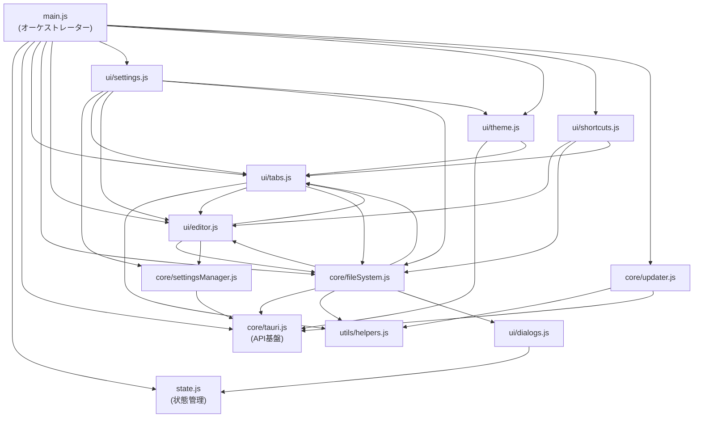

# リファクタリング結果レビュー

リファクタリングマスタープラン（フェーズ1〜5）の実施結果を、Rustバックエンド・フロントエンドJS両方について包括的にレビューしました。

---

## 総合評価

> [!TIP]
> **全体としては非常に良い仕上がりです。** main.rsは73行、main.jsは251行まで適切にスリム化され、責務分離・凝集度ともに高いレベルで達成されています。段階的なステップ実行により、デグレードなく安全にリファクタリングが進められたことが git 履歴からも確認できます。

以下、発見した問題点と改善案を**重要度順**にまとめます。

---

## 🔴 重要度: 高

### 1. `env!("USERPROFILE")` によるコンパイル時環境変数の埋め込み

**ファイル**: [settings.rs](file:///c:/work/NoCapEdit/src/settings.rs#L111-L112)

```rust
let documents = dirs::document_dir()
    .unwrap_or_else(|| PathBuf::from(env!("USERPROFILE")));
```

**問題**: `env!` マクロは**コンパイル時**の環境変数をバイナリに埋め込みます。ビルドした開発者のユーザーパス（例: `C:\Users\Developer`）がハードコードされるため、他のユーザーの環境では意図しないパスが使われる**潜在的バグ**です。

**改善案**: 実行時に環境変数を取得する `std::env::var` を使用する。

```diff
 let documents = dirs::document_dir()
-    .unwrap_or_else(|| PathBuf::from(env!("USERPROFILE")));
+    .unwrap_or_else(|| {
+        PathBuf::from(std::env::var("USERPROFILE").unwrap_or_else(|_| ".".to_string()))
+    });
```

> [!WARNING]
> この問題はリファクタリングで生じたものではなく、リファクタリング前から存在していた可能性が高いですが、配布時に影響が出るため優先して確認・修正することを推奨します。

---

## 🟡 重要度: 中

### 2. CLIとコマンドのロジック重複

**ファイル**: [cli.rs](file:///c:/work/NoCapEdit/src/cli.rs) / [commands.rs](file:///c:/work/NoCapEdit/src/commands.rs#L131-L141)

`cli::parse_launch_file_arg` と `commands::get_launch_file` で、コマンドライン引数からファイルパスを取得する処理が重複しています。さらに、`commands::get_launch_file` は相対パスの絶対パス解決を行っていません。

```diff
 #[tauri::command]
 pub fn get_launch_file() -> Option<String> {
-    let args: Vec<String> = std::env::args().collect();
-    if args.len() > 1 {
-        let path = &args[1];
-        if std::path::Path::new(path).is_file() {
-            return Some(path.clone());
-        }
-    }
-    None
+    crate::cli::parse_launch_file_arg()
 }
```

### 3. `helpers.js` と `state.js` で `AUTO_FILE_REGEX` が重複定義

**ファイル**: [helpers.js](file:///c:/work/NoCapEdit/src/dist/js/utils/helpers.js#L1) / [state.js](file:///c:/work/NoCapEdit/src/dist/js/state.js#L8)

```js
// helpers.js:1
export const AUTO_FILE_REGEX = /^\d{8}_\d{6}(_\d{2})?\.nctx$/;

// state.js:8
export const AUTO_FILE_REGEX = /^\d{8}_\d{6}(_\d{2})?\.nctx$/;
```

**改善案**: `helpers.js` 側のみに残して、`state.js` からは削除する。`state.js` はアプリケーション状態の管理に特化し、正規表現パターンのような定数は `helpers.js` や定数ファイルに集約すべき。

### 4. `state.js` のDOM要素キャッシュの初期化タイミング

**ファイル**: [state.js](file:///c:/work/NoCapEdit/src/dist/js/state.js#L53-L76)

```js
export const elements = {
    app: document.getElementById('app'),         // ← モジュール読み込み時に実行
    tabsContainer: document.getElementById('tabsContainer'),
    // ...
};
```

`elements` オブジェクトはモジュールのトップレベルで `document.getElementById` を呼んでいます。ES modules の読み込みが `DOMContentLoaded` より前に実行された場合、すべて `null` になる可能性があります。

現在は `initElements()` 関数でDOMContentLoaded後に再取得していますが、初期化時に `null` を設定している意図が不明確です。

**改善案**: 初期値はすべて `null` にして、`initElements()` で確実にDOMから取得するようにすると、意図が明確になる。

```diff
 export const elements = {
-    app: document.getElementById('app'),
-    tabsContainer: document.getElementById('tabsContainer'),
+    app: null,
+    tabsContainer: null,
     // ...
 };
```

### 5. `settings.js` の `saveSettings()` が複雑（約80行）

**ファイル**: [settings.js](file:///c:/work/NoCapEdit/src/dist/js/ui/settings.js#L91-L170)

`saveSettings()` 関数は、設定保存だけでなく「保存モード切替時のタブ名変換」「空ファイル削除」「タブ再描画」など多くの副作用を含んでおり、凝集度が低くなっています。

**改善案**: 保存モード切替時の処理（auto→manual / manual→auto のタブ名変換ロジック）を別関数に抽出すると可読性が向上する。

### 6. TCP通信のエラーハンドリング

**ファイル**: [instance.rs](file:///c:/work/NoCapEdit/src/instance.rs#L9-L16)

```rust
pub fn send_to_existing_instance(path: &str) -> bool {
    if let Ok(mut stream) = TcpStream::connect(...) {
        let _ = stream.write_all(path.as_bytes());  // ← エラー無視
        true
    } else {
        false
    }
}
```

`write_all` のエラーを無視して常に `true` を返しています。

```diff
-        let _ = stream.write_all(path.as_bytes());
-        true
+        stream.write_all(path.as_bytes()).is_ok()
```

---

## 🟢 重要度: 低

### 7. `fileSystem.js` のパス区切り文字ハードコード

**ファイル**: [fileSystem.js](file:///c:/work/NoCapEdit/src/dist/js/core/fileSystem.js#L232)

```js
const filePath = appState.homeFolder.replace(/[\\\/]$/, '') + '\\' + fileName;
```

手動保存時のパス生成でバックスラッシュ `\\` をハードコードしています。パス結合はRust側の `create_and_save_file` コマンドで行う方が安全です（実際に自動保存ではRust側で行っている）。

### 8. `updater.js` が直接DOMを操作

**ファイル**: [updater.js](file:///c:/work/NoCapEdit/src/dist/js/core/updater.js#L46-L68)

`core/` 層に配置されたモジュールが `document.getElementById` で直接DOMを操作しています。`state.js` の `elements` キャッシュを経由するか、UI通知用のコールバックを受け取る設計にすると、core/ui間の責務分離がより明確になります。

ただし、更新通知のDOM要素（`updateNoticeContainer` 等）は `elements` キャッシュに含まれていないため、現状のような直接アクセスになったのは理解できます。

### 9. `commands.rs` の `FileInfo` フィールドのアクセス修飾子

**ファイル**: [commands.rs](file:///c:/work/NoCapEdit/src/commands.rs#L8-L12)

```rust
pub struct FileInfo {
    file_name: String,   // ← private
    file_path: String,   // ← private
}
```

Serdeのシリアライズは動作しますが、構造体自体が `pub` であるのにフィールドが private なのは一般的でない設計です。将来的に他モジュールからデータ参照する際に不便になるため、`pub` にすることを検討してください。

### 10. `i18n.js` での `window.t()` のグローバル関数登録

**ファイル**: [i18n.js](file:///c:/work/NoCapEdit/src/dist/i18n.js#L173)

`window.t` としてグローバルに登録されているため、モジュールによって `window.t()` と `t()` の呼び出し方が混在しています（[main.js](file:///c:/work/NoCapEdit/src/dist/js/main.js#L119) vs [editor.js](file:///c:/work/NoCapEdit/src/dist/js/ui/editor.js#L50)）。

`i18n.js` を ES module にして `export function t(...)` として提供し、各モジュールが `import { t } from '../i18n.js'` で参照する設計にすると一貫性が向上します（ただし大きな変更になるため、将来の多言語化対応時にまとめて実施するのが現実的）。

---

## 設計面の良い点（特筆事項）

| 観点 | 評価 |
|---|---|
| main.rs のスリム化 | ✅ 73行。エントリポイント＋Tauriセットアップに特化 |
| main.js のスリム化 | ✅ 251行。初期化＋イベント登録のオーケストレーターに特化 |
| Rustモジュールの依存方向 | ✅ main → settings/instance/commands/cli/theme の一方向。循環依存なし |
| `tauri.js` の設計 | ✅ 循環参照防止の警告コメント付きで、APIラッパーとして最下層に配置 |
| `settingsManager.js` の分離 | ✅ 永続化ロジックのみで34行。高凝集 |
| `dialogs.js` の分離 | ✅ core層からUI依存を切り離す設計意図が明確 |
| `shortcuts.js` の分離 | ✅ キーボード/マウスホイール処理が独立モジュールに集約 |

---

## 依存関係図（フロントエンド）



> [!NOTE]
> 依存は基本的に `main → core/ui → utils/state` のレイヤー方向に流れていますが、`core/fileSystem.js ↔ ui/tabs.js` 間で相互参照があります（fileSystem → tabs.updateStatus / tabs → fileSystem.persistTabWithRecovery）。現状は ES modules の遅延解決で動作していますが、将来的にリファクタリングする場合の注意点として記録しておきます。

---

## まとめ

リファクタリングの成果は非常に良好です。主に対応を検討すべきは以下の3点です：

1. **🔴 `env!("USERPROFILE")`** — 配布時に他ユーザー環境で動作しないリスク（既存バグの可能性大）
2. **🟡 `get_launch_file` の重複** — `cli.rs` と `commands.rs` 間のDRY違反
3. **🟡 `AUTO_FILE_REGEX` の重複定義** — `state.js` と `helpers.js` 間

残りの指摘は品質向上のための提案であり、現時点で動作に影響するものではありません。
