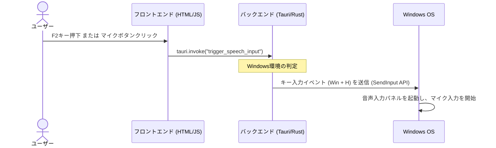

# 音声入力支援機能の実装計画 (WIP)

このドキュメントは、手が不自由なユーザー（棒等を使ってキーボードを1つずつ押す操作スタイルのユーザー）向けに、簡単な操作でOS標準の音声入力機能を起動できる支援機能の導入計画です。

---

## 1. 目的と背景
手が不自由なユーザーにとって、キーボードの複数キー同時押し（コンボキー）や、微細なマウス操作は困難を伴います。
Windowsには標準で非常に高精度な音声入力機能（`Win + H`）が備わっていますが、これを「棒によるキー打鍵」で呼び出すことは困難です。
そこで、アプリ側で単一キー（例: `F2` キー）の押下または画面上のわかりやすい「マイクボタン」をクリックするだけで、Windowsの音声入力（`Win + H`）を代わりにシミュレーション起動する機能を実装します。

---

## 2. システム構成・処理フロー

音声入力起動の流れは以下の通りです。



---

## 3. 実装方針

### 3.1. フロントエンド（JS/HTML）

1. **音声入力ボタンの配置**:
   - 画面の目立つ位置（ヘッダーまたはステータスバー付近）に、クリックしやすい少し大きめの「マイクアイコン」のボタンを追加します。
2. **ショートカットキーの検知**:
   - グローバルなキーダウンイベントリスナーを登録し、フォーカスがどこにあっても（テキストエリア入力中など）特定のシングルキー（デフォルト: `F2`）が押されたことを検知します。
   - キー検知時に、Tauriコマンド `trigger_speech_input` を呼び出します。
3. **設定画面への追加**:
   - 設定画面に「音声入力起動キー」の設定項目を追加します（キーの割り当て変更、または機能の有効/無効化）。
   - 音声入力は現状「Windows環境のみで動作する」旨の注意書きを表示します。

### 3.2. バックエンド（Tauri / Rust）

1. **Tauri コマンド `trigger_speech_input` の追加**:
   - `src/main.rs` にフロントエンドから呼び出されるコマンドを定義します。
2. **キー入力のシミュレーション実装**:
   - Windows環境において、`Win + H` のキーダウンおよびキーアップイベントを発生させます。
   - **アプローチA：既存の `windows-sys` を活用する（推奨）**
     - すでに `Cargo.toml` に導入されている `windows-sys` を使用し、Win32 APIの `SendInput` 関数を呼び出して `VK_LWIN` と `H` のキー入力をエミュレートします。追加のクレートを増やさないため、ビルド時間やバイナリサイズの増加を防げます。
   - **アプローチB：外部クレートを利用する**
     - キーシミュレーション用のクレート（例：`enigo`）を依存関係に追加して実装します。

#### アプローチA (SendInput) の実装イメージ：
```rust
#[cfg(target_os = "windows")]
use windows_sys::Win32::UI::Input::KeyboardAndMouse::{
    SendInput, INPUT, INPUT_KEYBOARD, KEYBDINPUT, KEYEVENTF_KEYUP, VIRTUAL_KEY, VK_LWIN
};

#[tauri::command]
fn trigger_speech_input() -> Result<(), String> {
    #[cfg(target_os = "windows")]
    {
        unsafe {
            // Windowsの仮想キーコード (VK_H = 0x48)
            const VK_H: VIRTUAL_KEY = 0x48;

            // 送信するキーイベントの配列 (Win Down -> H Down -> H Up -> Win Up)
            let mut inputs: [INPUT; 4] = std::mem::zeroed();

            // 1. Winキーを押す
            inputs[0].r#type = INPUT_KEYBOARD;
            inputs[0].Anonymous.ki = KEYBDINPUT {
                wVk: VK_LWIN,
                wScan: 0,
                dwFlags: 0,
                time: 0,
                dwExtraInfo: 0,
            };

            // 2. Hキーを押す
            inputs[1].r#type = INPUT_KEYBOARD;
            inputs[1].Anonymous.ki = KEYBDINPUT {
                wVk: VK_H,
                wScan: 0,
                dwFlags: 0,
                time: 0,
                dwExtraInfo: 0,
            };

            // 3. Hキーを離す
            inputs[2].r#type = INPUT_KEYBOARD;
            inputs[2].Anonymous.ki = KEYBDINPUT {
                wVk: VK_H,
                wScan: 0,
                dwFlags: KEYEVENTF_KEYUP,
                time: 0,
                dwExtraInfo: 0,
            };

            // 4. Winキーを離す
            inputs[3].r#type = INPUT_KEYBOARD;
            inputs[3].Anonymous.ki = KEYBDINPUT {
                wVk: VK_LWIN,
                wScan: 0,
                dwFlags: KEYEVENTF_KEYUP,
                time: 0,
                dwExtraInfo: 0,
            };

            let sent = SendInput(
                inputs.len() as u32,
                inputs.as_mut_ptr(),
                std::mem::size_of::<INPUT>() as i32,
            );
            
            if sent != inputs.len() as u32 {
                return Err("Failed to send key inputs".to_string());
            }
        }
        Ok(())
    }

    #[cfg(not(target_os = "windows"))]
    {
        Err("音声入力のシミュレーション起動は現在Windows環境のみサポートしています。".to_string())
    }
}
```

---

## 4. 懸念点・今後の調査事項

1. **管理者権限での実行時の挙動**:
   - アプリが管理者権限で実行されている場合、またはその逆の場合に、OSが `SendInput` APIによるイベント入力を受け付けない（または無視する）セキュリティ制限（UDA: User Interface Privilege Isolation）に引っかかる可能性があります。実際の環境での動作検証が必要です。
2. **フォーカスの維持**:
   - 音声入力を開始する際、エディタ（textareaやエディタ領域）にフォーカスが当たっていないと、音声認識された文字列が別の場所に書き込まれるか、入力されません。コマンド実行直前にエディタに強制フォーカスを当てる処理をフロントエンド側で入れる必要があります。
3. **他OS（macOS、Linux）での動作**:
   - macOSでは標準で音声入力起動のショートカット（Fnキー2回など）がありますが、OS設定により異なるため、Windowsほど単純にシミュレートできない場合があります。まずはWindows限定機能としてリリースし、他OS向けは段階的に調査するのが現実的です。
